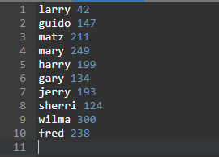
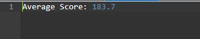
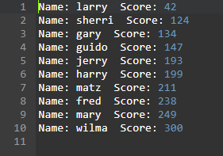
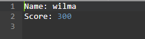
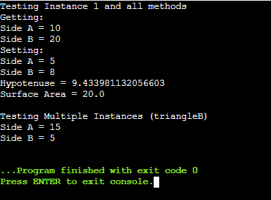
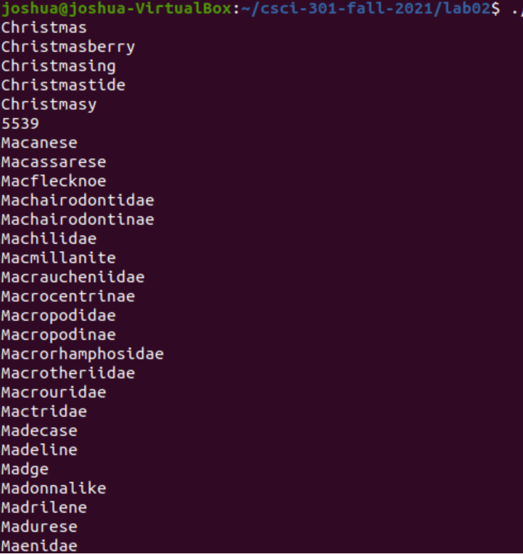
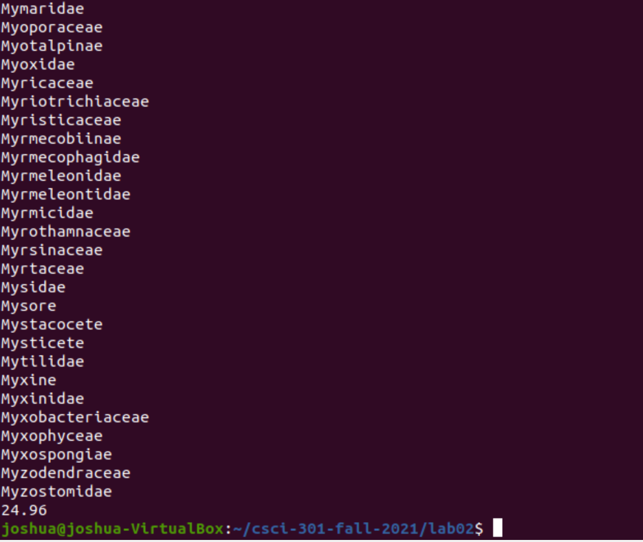

[Back to Portfolio](https://joshtomith.github.io/)

Scripting Project Compilation
===============

-   **Class: CSCI-301** 
-   **Grade: 100%**
-   **Language(s): Shell, Perl, Python**
-   **Source Code Repository:** [Scripting Project Portfolio](https://github.com/Joshtomith/Scripting-Project-Portfolio)  
    (Please [email me](mailto:JTSmith3@csustudent.net?subject=GitHub%20Access) to request access.)

## Project description

A collection of some of the scripting languages I learned at CSU. Included in the project is 3 different programs, that each are in their own respective language. The languages are as follows: Shell, Perl, and Python. Each acomplish a different task and are here to demonstrate mastery of a variety of problems/concepts. 
* Perl: Hashes and reading information from a file
* Python: Simple math calculations and utilizing classes/instancing
* Shell: Regular Expression when searching through large data sets

## How to compiles / run the programs

How to compile (if applicable) and run the project.

Shell Program:
```bash
1) Go into any normal linux terminal and cd into the directory with the file
2) Give permissions chmod 755 lab02.sh
3) Then run it with ./lab02.sh
4) Requires a file named words.txt, but can be filed with anything the user wants in terms of content (1 word per line).
```
Python Program:
```bash
1) Go to this link for an online python compiler: https://www.onlinegdb.com/online_python_compiler
2) Copy the source code or simply upload the file to the site (RightTriangle.py is main)
3) Press the execute button at the top, the code will output at the bottom in the terminal
```
Perl Program:
```bash
1) Go to this link for an online perl compiler: https://www.onlinegdb.com/online_perl_compiler#
2) Copy the source code or simply upload the files to the site. Only requires lab04.pl and scores.txt to function. (lab04.pl is main)
3) Press the execute button at the top, the code will output at the bottom in the terminal
```

## Image Examples

Below are screenshots taken from the three programs. They do not show source code, but do show the output/results of all programs. Considering there is no input for the programs there is notable UI elements to document. The Perl examples are screenshots of the files created, and the rest are derived from the terminal. Refer to the README.md file for any questions about the functionality of each program. 


<br>Fig 1. The Perl default input file and scores used


<br>Fig 2. The average of inputted scores of the Perl Program


<br>Fig 3. The Perl Sorted list of players based on the scores


<br>Fig 4. The Perl score winner based off default values


<br>Fig 5. Python testing and calculations of a right triangle


<br>Fig 6. First half of Shell output: words that start with Christmas, count of words ending in -ing and words that start with M and end an e (sorted)


<br>Fig 7. Second half of Shell output: last portion of words that start with M and end an e, and percentage of words with a starting vowel

## 3. Additional Considerations

This is a compilation of programs that come together to form a larger project. Its much easier to utilize online compilers with how many languages the project switches between. That being said the Shell program's text file that holds sample words is to big for most online compilers. In that case, as mentioned in instuctions, you would have to utilize a linux machine to run the shell program. Alternatively, you can simply provide your own words.txt to run from.


For more details see [README.md file](https://github.com/Joshtomith/Scripting-Project-Portfolio/blob/main/README.md).

[Back to Portfolio](https://joshtomith.github.io/)
