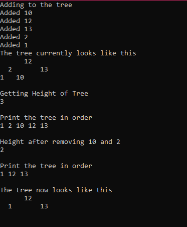

[Back to Portfolio](https://joshtomith.github.io/)

Scripting Project Compilation
===============

-   **Class: CSCI-315** 
-   **Grade: 75% (Fixed Errors Based on Feedback)**
-   **Language(s): C++**
-   **Source Code Repository:** [Data Structures Portfolio Project](https://github.com/Joshtomith/Data-Structures-Portfolio-)  
    (Please [email me](mailto:JTSmith3@csustudent.net?subject=GitHub%20Access) to request access.)

## Project description

This projects contains two different implementations of a balanced binary search tree data structure. The purpose of the project was to experiment with different techniques of this task, and how the differ in efficiency. This project choose to focus on the AVL tree and Splay tree implementations in particular. This is a full scale implementation, with the ability to add to, delete, find the height of the tree and etc. For in depth examination of the differences read Implementation Differnces.txt. There is a timing program inlcuded to track the speed of actions on the data structures in the src folder. However, you would need to pipe the results into a plotting program (such as gnuplot, that was used for the figure below).

## How to compiles / run the programs

Note: There are obj files if you want to run this off linux, but you'd have to use g++ to compile. However, if you have a windows machine the github release is much easier to run.

```
1) Download the exectuable from the github release.
2) Then run the exectuable to see the example AVL tree, and the program will demonstrate a critical methods of the implementation.

If you want to run Splay tree, either contact me or do this to the source files:
1) Go to this website https://www.onlinegdb.com/online_c++_compiler# 
2) import the files that you want to run. For Splay you'd import main, Splaybinarytree.hpp and Splaybinarytree.cpp
3) Change main to include the correct tree your running. For example, instead of #include "AVLbinarytree.hpp" it'd be #include "SplaybinaryTree.hpp"  
4) Click execute, and the main included will run a couple of basic functions to test the implementations.
```

## Image Examples

This is a timing chart of the time it takes to add to a tree, and rebalance to maintain order in the tree. In this example both trees preformed about the same in terms of speed before 4500 add operations. However, after this point AVL began to outpreform Splay overall. Especially near the end, Splay spiked to high levels. Meanwhile AVL maintained its constant stable rise with the increasing data sizes. The second image demonstrates a few critical functions that you need to operate a binary tree, and the results they have on the tree structure itself.


<br>Fig 1. Chart of the Timing for the different implementations. AVL Tree vs. Splay Tree


<br>Fig 2. AVL executable showing methods for add, delete, show in order, and how the tree balances.

## 3. Additional Considerations

Sometimes we have to consider not only the speed of operations with different implementations, but the time it takes to setup the data structure. AVL may have preformed better in speed with larger data sets, but Splay was much easier to implement. In a bussiness setting where a speed of implementation is a priority, Splay would be a serious contender.

For more in depth comparsion see [Implementations Differences file](Implementations_Differences.md).
<br>For more technical details see [README.md file](https://github.com/Joshtomith/Data-Structures-Portfolio-/blob/main/README.md).

[Back to Portfolio](https://joshtomith.github.io/)
